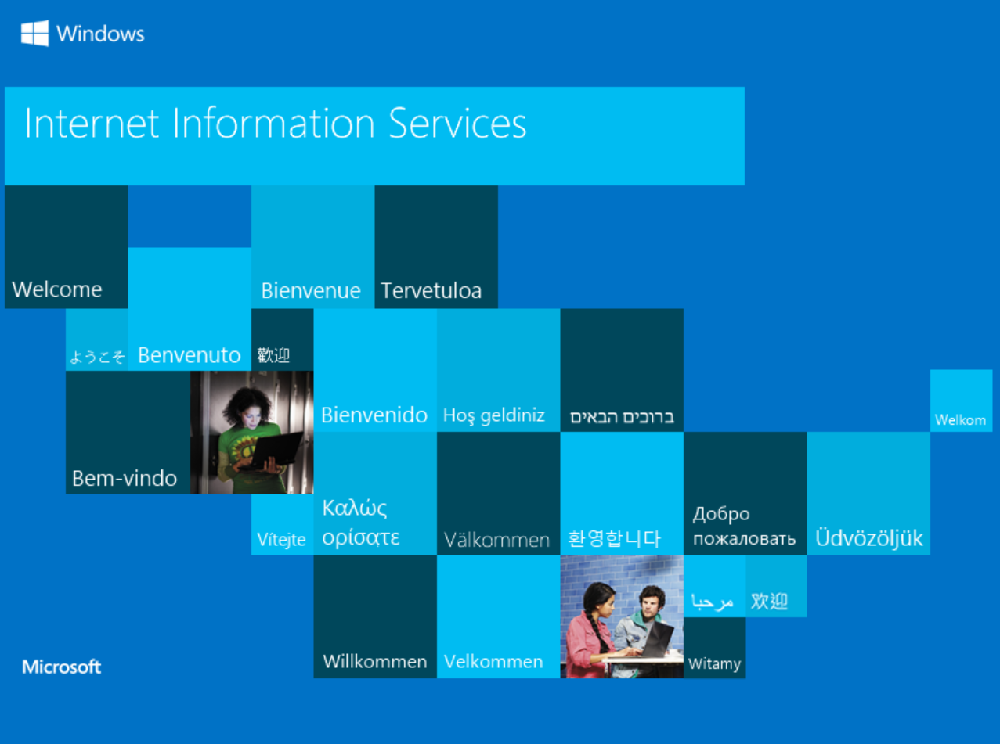
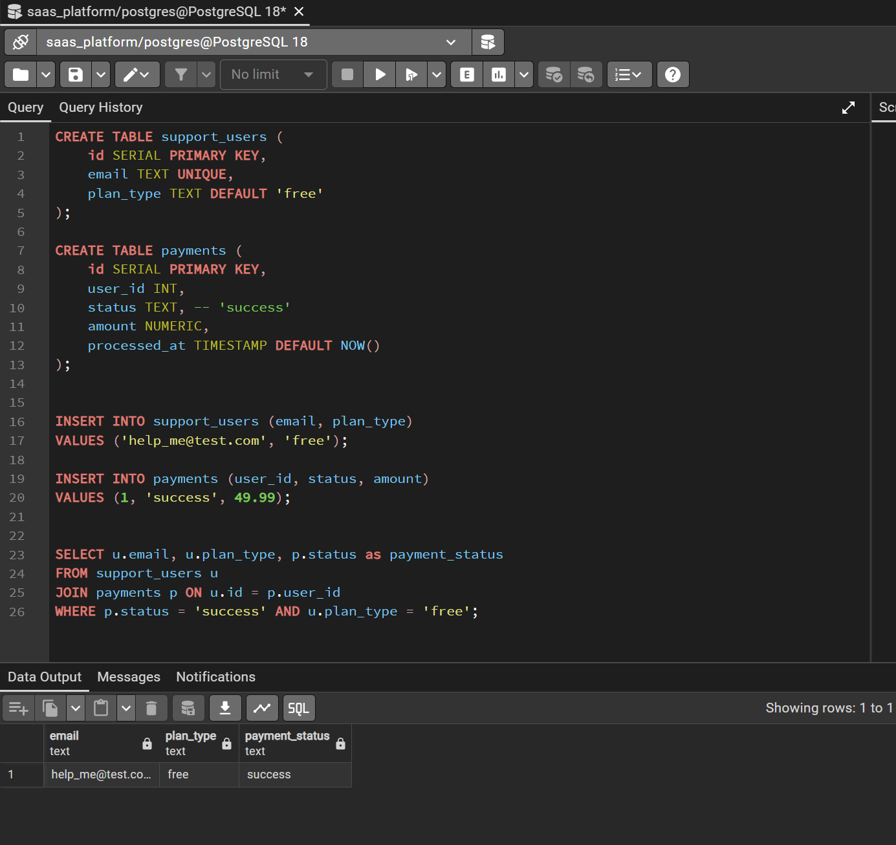
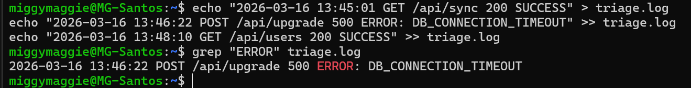
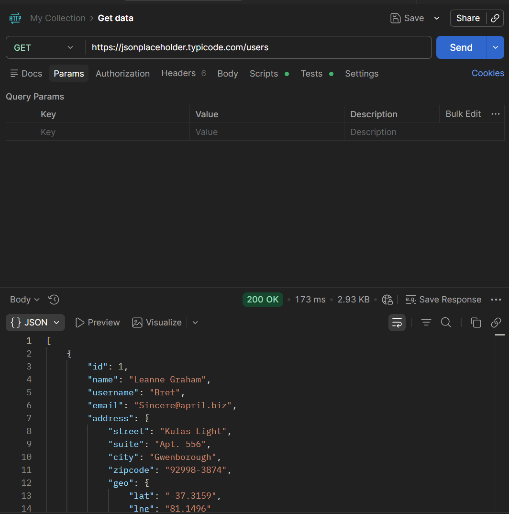

# MG Santos Technical Support (SaaS)

## Project Overview
I built this mockup Portfolio Project to simulate troubleshooting I do in a Technical Support role. Instead of just reading about tools, I set up a local environment to show how I actually track down bugs across the server, database, and API layers.

## Tools Used
* **Windows IIS:** To host the local web environment.
* **PostgreSQL:** For querying and fixing backend data.
* **Linux (WSL/Ubuntu):** For digging through server logs via the command line.
* **Postman:** To verify API health and response data.

---

## Troubleshooting Scenarios

### 1. Confirming Server Uptime
**Problem:** Need to verify the local application server is responding to requests.
**Fix:** Enabled Internet Information Services (IIS) on my Windows machine and verified the `localhost` handshake was successful.

---

### 2. Finding a Billing Mismatch (SQL)
**Problem:** A user (`help_me@test.com`) reported they paid for an upgrade but are still stuck on the "Free" plan.
**Investigation:** I ran a `JOIN` query between the users and payments tables. I found that the payment was "Success," but the user's plan type never updated in the database.

---

### 3. Log Diving for Root Cause (Linux)
**Problem:** Why didn't the billing sync work?
**Investigation:** I used `grep` in the Ubuntu terminal to search the `triage.log` file for errors. I found a `500 ERROR` showing a `DB_CONNECTION_TIMEOUT`, which explains why the update failed.
**Command:** `grep "ERROR" triage.log`

---

### 4. API Response Testing (Postman)
**Problem:** Testing if the user data is actually reachable by the front-end.
**Action:** Ran a `GET` request to pull user details. Confirmed the server is returning a `200 OK` status and the correct JSON data.

---

## Final Thoughts
This project shows I can jump into different parts of a tech stack to find the root cause of a ticket. I don't just "guess"—I use logs and database queries to prove what's broken before trying to fix it.
